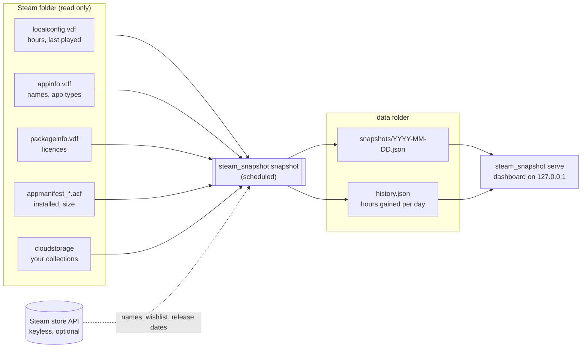

# Steamshot

Snapshots of your Steam library on a schedule, plus a small dashboard to browse them.

Steam only tells you a running total of hours per game and when you last played it.
It keeps no history at all. Steamshot runs in the background (Task Scheduler on
Windows, cron on Linux and macOS), saves a snapshot of your library each day, and
works out how much you played each game each day by comparing those snapshots.
The dashboard shows the result: playtime per day, what you played lately, what
changed since the previous snapshot, your Steam collections, your wishlist with
release countdowns, and a searchable library.


- **No API key, no login.** It reads the files the Steam client already keeps on disk.
- **Read-only.** Nothing in your Steam folder is ever modified.
- **Stays on your machine.** Snapshots are plain JSON files in a folder you choose. The
  dashboard listens on `127.0.0.1` only.
- **No dependencies.** Python 3.11+ standard library only; it runs straight from the folder.

## How it works



Each run reads the library and writes today's snapshot. A later run on the same day
replaces it, so you keep one snapshot per day. Each run also adds the hours gained
since the previous run to `history.json`. **History starts with your first snapshot and
cannot be backfilled**, so it's worth scheduling it early.

## Set it up on a PC

Do this on the PC where you play, since it reads that PC's Steam files. It takes about
five minutes. The command is always `python -m steam_snapshot`, whatever the folder is called.

### 1. Get access to the code

This repository is private. Ask the owner to add your GitHub account under
**Settings > Collaborators**, then accept the invite from your email. Alternatively,
sign in to GitHub and use **Code > Download ZIP** on the repository page.

### 2. Install Python 3.11+ (and Git)

**Windows** (PowerShell):

```powershell
winget install Python.Python.3.13
winget install Git.Git
```

Close and reopen PowerShell, then check: `py -3 --version` should print 3.11 or newer.
On Windows, use `py -3` wherever this guide says `python`. Plain `python` may open the
Microsoft Store instead.

**macOS:** `brew install python git`. **Linux:** your distribution's `python3` (3.11+) and
`git` packages. On both, use `python3` wherever this guide says `python`.

You also need the **Steam desktop client** installed, and logged in on this PC at least once.

### 3. Download it to a permanent folder

The scheduled job runs from this folder, so pick a place you won't move or delete:

```powershell
# Windows
cd $HOME
git clone https://github.com/betemonkey/steamshot.git
cd steamshot
```

```bash
# Linux / macOS
cd ~
git clone https://github.com/betemonkey/steamshot.git
cd steamshot
```

Git will ask you to sign in to GitHub the first time, because the repository is private.
If you downloaded the ZIP instead, unzip it into that permanent place and `cd` into it.

### 4. Try the dashboard with demo data (optional)

```bash
python -m steam_snapshot demo --open
```

This opens http://127.0.0.1:8765 with invented data, so you can see what you'll get.
Press Ctrl+C in the terminal to stop it.

### 5. Configure and check

```bash
python -m steam_snapshot init      # creates config.toml from the example
python -m steam_snapshot doctor    # shows what it can see; changes nothing
```

`doctor` should list your Steam folder, your account (marked with `*`), and `[ok]` for
each data source. With one Steam account on the PC, the defaults work as they are.
Otherwise, open `config.toml` and set the options described in
[Configuration](#configuration), such as the account, the data folder or how long to keep
snapshots.

For the wishlist, your Steam profile's **Game details** must be Public:
Steam > your profile > Edit Profile > Privacy Settings. `doctor` tells you if it isn't.

### 6. Take the first snapshot

```bash
python -m steam_snapshot snapshot
```

It prints something like `snapshot saved: 87 games, 1,240 h, wishlist 12 (ok)`.

### 7. Run it automatically

```bash
python -m steam_snapshot schedule
```

This **prints** the command for your system with this PC's paths already filled in; it
doesn't install anything by itself. Copy what it prints:

- **Windows:** paste the printed block into PowerShell. It creates a Task Scheduler task
  named `steam-snapshot` that runs every 30 minutes while you're logged in. To test it
  right away, run `Start-ScheduledTask -TaskName steam-snapshot`.
- **Linux / macOS:** run `crontab -e` and add the printed line.

Check that it's firing: every run adds a line to `data/steam-snapshot.log`. See
[Scheduling](#scheduling) for other intervals and how to remove it.

### 8. Open the dashboard

```bash
python -m steam_snapshot serve --open
```

The dashboard runs while that terminal is open. Start it again whenever you want to look.
The snapshots keep being taken in the background either way.

### Updating

```bash
cd steamshot     # the folder from step 3
git pull
```

Your `config.toml` and `data/` folder are never touched by an update.

### Moving to a new PC, or using several

Your history lives in the `data/` folder. To move to a new PC, set it up there (steps 1-7)
and copy the old `data/` folder over before the first snapshot. Several PCs each keep
their own history; they are not merged.

## Configuration

`python -m steam_snapshot init` copies [`config.example.toml`](config.example.toml) to
`config.toml`, and every option is explained in that file. Every key is optional: with no
config at all, the tool uses the most recent Steam account on the machine and stores
data in `./data`.

| Section | Key | Default | What it does |
|---|---|---|---|
| `[steam]` | `path` | `"auto"` | Steam install folder. Auto-detects Windows, Linux (native, Flatpak, Snap) and macOS installs. |
| | `account` | `"auto"` | Which account to snapshot if several logged in here. `auto` = most recently used; otherwise a SteamID64 or the account id from `Steam/userdata/<id>`. |
| `[snapshot]` | `data_dir` | `"data"` | Where snapshots go. Relative to the config file. |
| | `keep_days` | `365` | Days of snapshots and history to keep. `0` keeps everything. |
| | `include_unowned` | `false` | Keep refunded or expired games that still carry old playtime. |
| | `hide_appids` | `[]` | App ids to always leave out. |
| `[online]` | `enabled` | `true` | Allow keyless calls to Steam's public store API. `false` = no network at all. |
| | `wishlist` | `true` | Fetch your wishlist. Needs a public "Game details" privacy setting. |
| | `country`, `language` | `"US"`, `"english"` | Store region and language for names and release dates. |
| `[dashboard]` | `host`, `port` | `127.0.0.1`, `8765` | Where the dashboard listens. |
| | `images` | `true` | Load cover art from Steam's image CDN. |

The config is found in this order: `--config <path>`, then the `STEAM_SNAPSHOT_CONFIG`
environment variable, then `config.toml` in the project folder.

`doctor` shows what the tool sees with your current config: the Steam folder, every
account on the machine (and which one will be read), which data sources are readable,
the size of the library, and whether your wishlist is visible. It changes nothing.

## Scheduling

`python -m steam_snapshot schedule` prints the exact command for your machine, with the
right paths already filled in. Use `--every <minutes>` to change the interval (default 30;
allowed: 5, 10, 15, 20, 30, 60, or whole hours like 120). Runs are cheap: a few local
file reads and at most three small web requests.

### Windows (Task Scheduler)

`schedule` prints a PowerShell block like this one. Paste it into PowerShell (no admin
needed):

```powershell
$action = New-ScheduledTaskAction -Execute 'C:\...\pythonw.exe' -Argument '-m steam_snapshot snapshot' -WorkingDirectory 'C:\...\steamshot'
$trigger = New-ScheduledTaskTrigger -Once -At (Get-Date) -RepetitionInterval (New-TimeSpan -Minutes 30)
$settings = New-ScheduledTaskSettingsSet -StartWhenAvailable -AllowStartIfOnBatteries -DontStopIfGoingOnBatteries -ExecutionTimeLimit (New-TimeSpan -Minutes 10)
Register-ScheduledTask -TaskName 'steam-snapshot' -Action $action -Trigger $trigger -Settings $settings -Description 'Snapshot of the Steam library (steam-snapshot)'
```

It uses `pythonw.exe`, so no console window flashes up on each run. The task runs while
you're logged in, which is also when Steam is in use. To run it right away:
`Start-ScheduledTask -TaskName steam-snapshot`. To remove it:
`Unregister-ScheduledTask -TaskName steam-snapshot -Confirm:$false`.

### Linux and macOS (cron)

`schedule` prints one line. Add it with `crontab -e`:

```cron
*/30 * * * * cd '/home/you/steamshot' && '/usr/bin/python3' -m steam_snapshot snapshot >/dev/null 2>&1
```

To remove it, delete the line again with `crontab -e`.

### Is it running?

Every run appends one line to `data/steam-snapshot.log`:

```
2026-10-01T21:00:02+00:00 ok 7656119XXXXXXXXXX 2026-10-01: 87 games, 1240 h, wishlist 12 (ok)
```

A failed run logs `FAILED: <reason>`. Run `python -m steam_snapshot snapshot` by hand
to see the same message on screen.

## The dashboard

```bash
python -m steam_snapshot serve          # http://127.0.0.1:8765
python -m steam_snapshot serve --open   # and open it in your browser
python -m steam_snapshot serve --port 9000
```

- **Tiles:** games, total hours, hours in the last 30 days, installed size, never played.
  Each tile compares against the previous snapshot or period.
- **Playtime per day:** 30 or 90 days, with the games behind each bar on hover. Days
  before your first snapshot are shaded as "not recorded yet" rather than shown as zero.
- **Played lately:** most hours in the last 30 days.
- **Changes:** what you played, bought or lost since the previous snapshot.
- **Collections:** hours per Steam collection.
- **Wishlist:** unreleased games first, with a countdown for the ones that have a date.
- **Library:** search, filter by collection or installed, sort by any column.
- **Snapshot picker (top right):** view the library as it was on any stored day.

If several Steam accounts have snapshots, an account picker appears. The page follows
your system's light or dark mode; the ◐ button switches it.

To view it from another device, set `host = "0.0.0.0"` under `[dashboard]`. Anyone on
your network can then see your library, since the dashboard has no login.

## What is read, sent and stored

| | |
|---|---|
| **Read** (never written) | In the Steam folder: `userdata/<id>/config/localconfig.vdf`, `appcache/appinfo.vdf`, `appcache/packageinfo.vdf`, `steamapps/appmanifest_*.acf` (in every library folder), `userdata/<id>/config/cloudstorage/cloud-storage-namespace-1.json`, and the profile names from `config/loginusers.vdf`. Login names and saved-password flags in that file are not read. |
| **Sent** (only with `[online] enabled = true`) | To Steam's public endpoints (`api.steampowered.com`, `store.steampowered.com`): app ids whose names Steam's local cache is missing, your wishlist's app ids, and your SteamID64 for the wishlist request. No key, no cookies, nothing else. |
| **Loaded by the dashboard** | Cover art from Steam's image CDN, unless `images = false`. |
| **Stored** | `data/<steamid64>/snapshots/*.json`, `history.json` and `names.json`, plus `data/steam-snapshot.log`. Nothing outside the data folder. |

`config.toml`, `data/` and `demo-data/` are in `.gitignore`, so your library never ends up
in a commit.

### Snapshot format

```jsonc
{
  "schema": 1,
  "taken": "2026-10-01T21:00:02+00:00",
  "date": "2026-10-01",
  "account": { "steamid64": "7656119...", "accountId": 123, "persona": "Your name" },
  "games": [
    {
      "appid": 620, "name": "Portal 2", "type": "game",
      "minutes": 1234,              // total playtime
      "lastPlayed": 1727800000,     // unix time, 0 = never
      "installed": true, "bytes": 13000000000,
      "owned": true,                // from the licence list; absent if unknown
      "collections": ["Strategy"],
      "favourite": true, "hidden": true   // only when set in Steam
    }
  ],
  "wishlist": [
    { "appid": 0, "name": "", "added": "2026-01-01", "releaseISO": "2026-11-12",
      "release": "12 Nov 2026", "comingSoon": true }
  ],
  "wishlistStatus": "ok",           // ok | private | error | off
  "sources": { "localconfig": true, "appinfo": true, "packageinfo": true, "collections": true },
  "notes": []
}
```

`history.json` holds `days: { "YYYY-MM-DD": { "<appid>": minutes gained } }`.

## Good to know

- **Fresh data depends on Steam.** The snapshot reads what the Steam client has written
  to disk, and Steam writes playtime when a game closes. A game that is still running
  shows up in the next snapshot after you quit it.
- **The first day has no history.** The first run only records a starting point; a game
  first seen in a snapshot counts 0 hours that day, so a purchase never shows up as a fake
  spike.
- **Refunds and free weekends** keep their old playtime in Steam's files. The licence list
  (`packageinfo.vdf`) filters them out. If that file looks like another account's (several
  people use the PC), the filter is switched off rather than hiding most of your library.
  `doctor` shows when that happens.
- **Steam Family:** a game shared through Steam Family looks owned. Add its app id to
  `hide_appids` if you don't want it counted.
- **Dynamic collections** (collections built from a filter) only include games added to
  them by hand, because the filter can't be evaluated offline.
- **Demos** can't be put into collections in Steam, so they show as their own "Demos" group.
- **One machine per data folder.** Snapshots from two PCs are not merged. Pick the PC you
  play on, or give each its own `data_dir`.
- **Tested on Windows 11** with a real library. Steam auto-detection for Linux (native,
  Flatpak, Snap) and macOS uses the standard install paths but hasn't been run on those
  systems yet. If `doctor` can't find Steam, set `[steam] path` and please open an issue.

## Troubleshooting

| Symptom | Fix |
|---|---|
| `Steam install not found` | Set `[steam] path` in `config.toml` to the folder that contains `userdata`. |
| Wrong account | `doctor` lists every account on the machine; set `[steam] account` to the right SteamID64. |
| Wishlist says *not readable* | Steam > your profile > Edit Profile > Privacy Settings > **Game details: Public**. |
| Some games show as `App 12345` | Steam's cache doesn't know them and online lookups are off or failed; enable `[online]` or wait for the next run. |
| Nothing in "Played lately" | Normal for the first day: hours are counted between snapshots. |
| Port already in use | `serve --port 9000`, or change `[dashboard] port`. |
| Scheduled task never runs | Check `data/steam-snapshot.log`. On Windows, open Task Scheduler and look at the task's *Last Run Result*. On Linux, check that cron is running and that the path in the line is absolute. |

## Development

```bash
python -m unittest discover tests
```

The tests build a fake Steam folder (text and binary VDF files in the real formats) in a
temp directory, so they run offline and don't need Steam installed.

```
steam_snapshot/
  steamfiles.py   reads the Steam client's files (all parsers; read-only)
  store.py        keyless Steam store / wishlist lookups
  snapshot.py     takes a snapshot, keeps history, prunes old days
  server.py       the dashboard's tiny read-only web server
  web/index.html  the dashboard (one file, no external scripts)
  demo.py         invented data for trying the dashboard
  cli.py          the command line
```

## Uninstall

1. Remove the scheduled task (Windows: `Unregister-ScheduledTask -TaskName steam-snapshot -Confirm:$false`)
   or delete the cron line (`crontab -e`).
2. Delete the folder. Your snapshots are in its `data/` folder unless you moved `data_dir`.

## License

MIT, see [LICENSE](LICENSE). Not affiliated with Valve. Steam and the Steam logo are
trademarks of Valve Corporation.
