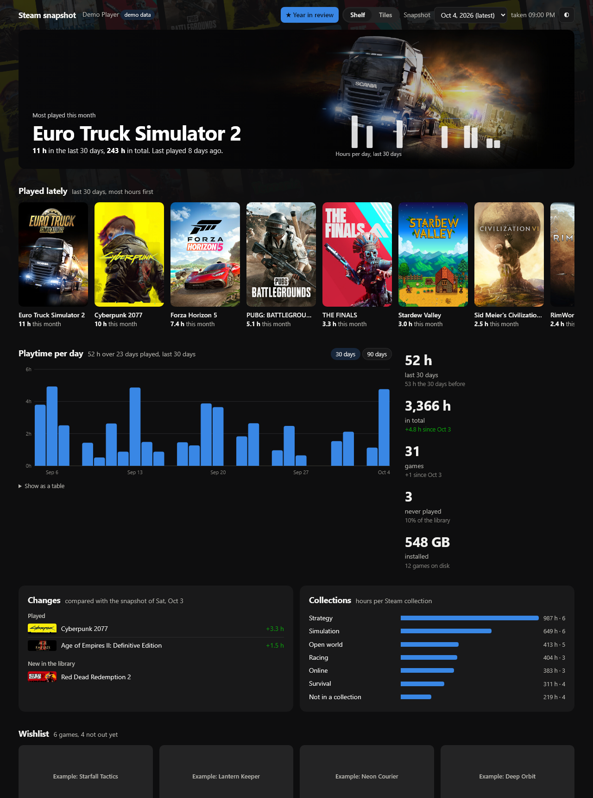
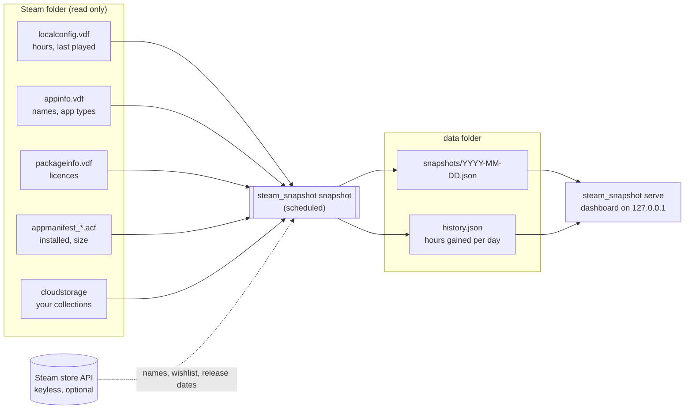

# Steamshot

Snapshots of your Steam library on a schedule, plus a small dashboard to browse them.

Steam only tells you a running total of hours per game and when you last played it.
It keeps no history at all. Steamshot runs in the background (Task Scheduler on
Windows, cron on Linux and macOS), saves a snapshot of your library each day, and
works out how much you played each game each day by comparing those snapshots.
The dashboard shows the result: playtime per day, what you played lately, what
changed since the previous snapshot, your Steam collections, your wishlist with
release countdowns, and a searchable library.



- **No API key, no login.** It reads the files the Steam client already keeps on disk.
  An API key is an optional extra, only for exact ownership (see
  [Optional API key](#optional-api-key-exact-ownership-and-your-steam-profile)).
- **Read-only.** Nothing in your Steam folder is ever modified.
- **Stays on your machine.** Snapshots are plain JSON files in a folder you choose. The
  dashboard listens on `127.0.0.1` only.
- **No dependencies.** Python 3.11+ standard library only; it runs straight from the folder.

## How it works



Each run reads the library and writes today's snapshot. A later run on the same day
replaces it, so you keep one snapshot per day. Each run also adds the hours gained
since the previous run to `history.json`. **History starts with your first snapshot and
cannot be backfilled**, so it's worth scheduling it early.

## Set it up on a PC

Do this on the PC where you play, since it reads that PC's Steam files. It takes about
five minutes. The command is always `python -m steam_snapshot`, whatever the folder is called.

### 1. Get the code

Clone it with Git (step 3), which lets it update itself, or use **Code > Download ZIP**
on the repository page.

### 2. Install Python 3.11+ (and Git)

**Windows** (PowerShell):

```powershell
winget install Python.Python.3.13
winget install Git.Git
```

Close and reopen PowerShell, then check: `py -3 --version` should print 3.11 or newer.
On Windows, use `py -3` wherever this guide says `python`. Plain `python` may open the
Microsoft Store instead.

**macOS:** `brew install python git`. **Linux:** your distribution's `python3` (3.11+) and
`git` packages. On both, use `python3` wherever this guide says `python`.

You also need the **Steam desktop client** installed, and logged in on this PC at least once.

### 3. Download it to a permanent folder

The scheduled job runs from this folder, so pick a place you won't move or delete. Keep it
inside your own user folder (as below): a folder straight under `C:\` can be changed by
every account on the PC, and the scheduled job runs whatever code is in it. Avoid a
OneDrive or Dropbox folder too, since your `data/` would be uploaded and sync locks can
make runs fail.

```powershell
# Windows
cd $HOME
git clone https://github.com/betemonkey/steamshot.git
cd steamshot
```

```bash
# Linux / macOS
cd ~
git clone https://github.com/betemonkey/steamshot.git
cd steamshot
```

If you downloaded the ZIP instead, unzip it into that permanent place and `cd` into it.

### 4. Try the dashboard with demo data (optional)

```bash
python -m steam_snapshot demo --open
```

This opens http://127.0.0.1:8765 with invented data, so you can see what you'll get.
Press Ctrl+C in the terminal to stop it.

### 5. Configure and check

```bash
python -m steam_snapshot init      # creates config.toml from the example
python -m steam_snapshot doctor    # shows what it can see; changes nothing
```

`doctor` should list your Steam folder, your account (marked with `*`), and `[ok]` for
each data source. With one Steam account on the PC, the defaults work as they are.
Otherwise, open `config.toml` and set the options described in
[Configuration](#configuration), such as the account, the data folder or how long to keep
snapshots.

For the wishlist, your Steam profile's **Game details** must be Public:
Steam > your profile > Edit Profile > Privacy Settings. `doctor` tells you if it isn't.

### 6. Take the first snapshot

```bash
python -m steam_snapshot snapshot
```

It prints something like `snapshot saved: 87 games, 1,240 h, wishlist 12 (ok)`.

### 7. Run it automatically

```bash
python -m steam_snapshot schedule
```

This **prints** the command for your system with this PC's paths already filled in; it
doesn't install anything by itself. Copy what it prints:

- **Windows:** paste the printed block into PowerShell. It creates a Task Scheduler task
  named `steam-snapshot` that runs every 30 minutes while you're logged in. To test it
  right away, run `Start-ScheduledTask -TaskName steam-snapshot`.
- **Linux / macOS:** run `crontab -e` and add the printed line.

Check that it's firing: every run adds a line to `data/steam-snapshot.log`. See
[Scheduling](#scheduling) for other intervals and how to remove it.

### 8. Open the dashboard

```bash
python -m steam_snapshot serve --open
```

The dashboard runs while that terminal is open. Start it again whenever you want to look.
The snapshots keep being taken in the background either way.

**Desktop shortcut (Windows):** to start the dashboard with a double-click instead, create
a Steamshot icon on the desktop:

```powershell
py -3 -m steam_snapshot shortcut
```

The icon runs `open`: if the dashboard isn't running yet it starts it in the background,
with no window, then opens the page; if it is already running (from a terminal or an
earlier click) it just opens the page. The background dashboard keeps running until you
sign out, and restarts itself on new code like the terminal one. An older
`Steamshot.url` icon from earlier versions only opened the page and can be deleted.

### Updating

Steamshot updates itself. Every 6 hours the scheduled snapshot (and the dashboard, while
it runs) asks GitHub for the newest version. If there is one, it runs `git pull`, and an
open dashboard restarts and reloads the page within about a minute. Nothing to do.

It only updates itself when the folder is a clean git checkout of `main`. If it can't (no
git, a zip download, files you edited, another branch), the dashboard shows a banner
instead and you update by hand:

```bash
cd steamshot     # the folder from step 3
git pull
```

Set `auto = false` under `[updates]` to always get the banner instead, or `check = false`
to never look. Versions before 1.1.0 can't update themselves, so pull once by hand to
get this.

Your `config.toml` and `data/` folder are never touched by an update.

Automatic updates mean the code on your PC follows this repository's `main` branch. If
you would rather read each change before running it, set `auto = false` and pull by hand.

Snapshots and history are now kept forever by default. If you created your `config.toml`
with `init` before that change, it still says `keep_days = 365`, which deletes anything
older than a year. Set it to `0` (or remove the line) to keep everything.

### Moving to a new PC, or using several

Your history lives in the `data/` folder. To move to a new PC, export it on the old one:

```bash
python -m steam_snapshot export          # writes steamshot-export-<date>.zip
```

then set Steamshot up on the new PC (steps 1-7) and import the zip there:

```bash
python -m steam_snapshot import steamshot-export-2026-10-04.zip
```

Several PCs each keep their own history; they are not merged automatically.

### Export and import

`export` saves every account's snapshots and playtime history into one zip (`--account`
for just one, `--out` to choose the file). Use it as a backup, or to move to another PC.

`import` merges a file into this install. It takes an export zip, or a bare history file
in the same shape as `data/<steamid64>/history.json`:

```json
{"since": "2026-07-14", "days": {"2026-07-15": {"620": 45, "1091500": 120}}}
```

(minutes played per game per day, by app id), which is how to bring in a playtime history
another tool recorded. A history file goes to this PC's account, or the one given with
`--account <steamid64>`.

Importing never overwrites what this install recorded itself. Days from its own first
snapshot onwards stay as they are, and snapshots it already has are kept; imported days
only fill in the time before. Running the same import twice changes nothing. The dashboard
picks the new history up on its next refresh.

An import is checked field by field: anything that isn't the right type (a game id that
isn't a number, an artwork address that isn't on Steam's image server, a date in the
future) is dropped, and a damaged zip changes nothing. Still, only import files you made
yourself or trust.

An export contains your SteamID64, your Steam profile name and your whole playtime
history, so think before sharing one.

## Configuration

`python -m steam_snapshot init` copies [`config.example.toml`](config.example.toml) to
`config.toml`, and every option is explained in that file. Every key is optional: with no
config at all, the tool uses the most recent Steam account on the machine and stores
data in `./data`.

| Section | Key | Default | What it does |
|---|---|---|---|
| `[steam]` | `path` | `"auto"` | Steam install folder. Auto-detects Windows, Linux (native, Flatpak, Snap) and macOS installs. |
| | `account` | `"auto"` | Which account to snapshot if several logged in here. `auto` = most recently used; otherwise a SteamID64 or the account id from `Steam/userdata/<id>`. |
| `[snapshot]` | `data_dir` | `"data"` | Where snapshots go. Relative to the config file. |
| | `keep_days` | `0` | Days of snapshots and history to keep. `0` keeps everything, forever. |
| | `include_unowned` | `false` | Keep refunded or expired games that still carry old playtime. |
| | `hide_appids` | `[]` | App ids to always leave out. |
| `[online]` | `enabled` | `true` | Allow keyless calls to Steam's public store API, and the update check. `false` = the snapshot and server make no network calls. The dashboard page still loads cover art from Steam's CDN unless `images = false`. |
| | `wishlist` | `true` | Fetch your wishlist. Needs a public "Game details" privacy setting. |
| | `country`, `language` | `"US"`, `"english"` | Store region and language for names and release dates. |
| | `steam_api_key` | `""` | Optional. Your own Steam Web API key, for exact ownership (no refunds, no Steam Family games) and the "From your Steam profile" block (hours per device, achievements, playing now). Empty = off. See [Optional API key](#optional-api-key-exact-ownership-and-your-steam-profile). |
| `[dashboard]` | `host`, `port` | `127.0.0.1`, `8765` | Where the dashboard listens. |
| | `images` | `true` | Load cover art from Steam's image CDN. |
| `[updates]` | `check` | `true` | Look up the newest version on GitHub every 6 hours. Off when `[online] enabled = false`. |
| | `auto` | `true` | Install new versions with `git pull` and reload the dashboard. `false` = only show a banner. |

The config is found in this order: `--config <path>`, then the `STEAM_SNAPSHOT_CONFIG`
environment variable, then `config.toml` in the project folder.

`doctor` shows what the tool sees with your current config: the Steam folder, every
account on the machine (and which one will be read), which data sources are readable,
the size of the library, and whether your wishlist is visible. It changes nothing.

### Optional API key: exact ownership and your Steam profile

Steam doesn't keep a list of what you own on disk, only a cache of licences
(`packageinfo.vdf`). That cache still counts games you refunded and games a Steam Family
member shares with you, so they can show up as yours. Most people never notice; if you do,
there are two fixes:

- list the odd ones in `hide_appids`, or
- give Steamshot your own **Steam Web API key**. It then asks Steam for the games you
  actually own (`IPlayerService/GetOwnedGames`) and uses that instead of the cache.
  Free-to-play games count once you've played them, as on your Steam profile.

With a key the dashboard also gets a **From your Steam profile** block (Shelf: under the
playtime panel; Tiles: one more row):

- **Where you play:** your hours split by Windows, Steam Deck, Linux and macOS. Steam only
  started counting per device a few years ago; hours from before that are shown as their
  own hatched part, not as a device. Plus your hours in the last two weeks.
- **Achievements:** how many you've unlocked in the games you've played, the games
  **closest to 100%** (only games with 10 or more achievements, so a one-achievement game
  can't top the list), and your **latest unlocks** with their icons.
- **Playing now:** a slim strip at the top while you're in a game. The page asks the
  dashboard once a minute while it's open and visible, and the dashboard asks Steam at
  most once a minute.

Achievements cost one request per game, so they fill in gently: each snapshot asks about
at most 25 games, played ones first, and later runs only ask again about games you've
played since (or after a week). A big library takes a few snapshots to fill in.

This is entirely optional; without a key everything works as before. To set it up:

1. Sign in at <https://steamcommunity.com/dev/apikey>, enter any domain name (e.g.
   `localhost`), accept the terms and register. Steam may ask you to confirm in the Steam
   Mobile app; reload the page afterwards to see the key (32 letters and digits).
2. Put it in your `config.toml` under `[online]`: `steam_api_key = "..."`, or set the
   `STEAM_SNAPSHOT_API_KEY` environment variable instead.
3. Run `doctor`: it should say `API key  set, works: N owned games` and
   `Ownership  api`.

The key stays in your local `config.toml` (which is in `.gitignore`). It is sent only to
`api.steampowered.com`, and never written to the log, a snapshot, an export or the
dashboard. If the owned-games call fails (Steam down, key revoked), the snapshot falls
back to the licence cache and says so in its notes, and the profile block keeps its last
numbers. Nothing is called with `[online] enabled = false`. Without a key, the dashboard
looks exactly as before, with one quiet line at the bottom pointing here.

## Scheduling

`python -m steam_snapshot schedule` prints the exact command for your machine, with the
right paths already filled in. Use `--every <minutes>` to change the interval (default 30;
allowed: 5, 10, 15, 20, 30, 60, or whole hours like 120). Runs are cheap: a few local
file reads and at most three small web requests.

### Windows (Task Scheduler)

`schedule` prints a PowerShell block like this one. Paste it into PowerShell (no admin
needed):

```powershell
$action = New-ScheduledTaskAction -Execute 'C:\...\pythonw.exe' -Argument '-m steam_snapshot snapshot' -WorkingDirectory 'C:\...\steamshot'
$trigger = New-ScheduledTaskTrigger -Once -At (Get-Date) -RepetitionInterval (New-TimeSpan -Minutes 30)
$settings = New-ScheduledTaskSettingsSet -StartWhenAvailable -AllowStartIfOnBatteries -DontStopIfGoingOnBatteries -ExecutionTimeLimit (New-TimeSpan -Minutes 10)
Register-ScheduledTask -TaskName 'steam-snapshot' -Action $action -Trigger $trigger -Settings $settings -Description 'Snapshot of the Steam library (steam-snapshot)'
```

It uses `pythonw.exe`, so no console window flashes up on each run. The task runs while
you're logged in, which is also when Steam is in use. To run it right away:
`Start-ScheduledTask -TaskName steam-snapshot`. To remove it:
`Unregister-ScheduledTask -TaskName steam-snapshot -Confirm:$false`.

### Linux and macOS (cron)

`schedule` prints one line. Add it with `crontab -e`:

```cron
*/30 * * * * cd '/home/you/steamshot' && '/usr/bin/python3' -m steam_snapshot snapshot >/dev/null 2>&1
```

To remove it, delete the line again with `crontab -e`.

### Is it running?

Every run appends one line to `data/steam-snapshot.log`:

```
2026-10-01T21:00:02+00:00 ok 7656119XXXXXXXXXX 2026-10-01: 87 games, 1240 h, wishlist 12 (ok)
```

A failed run logs `FAILED: <reason>`. Run `python -m steam_snapshot snapshot` by hand
to see the same message on screen.

## The dashboard

```bash
python -m steam_snapshot serve          # http://127.0.0.1:8765
python -m steam_snapshot serve --open   # and open it in your browser
python -m steam_snapshot serve --port 9000
python -m steam_snapshot open           # start it in the background if needed, then open it
python -m steam_snapshot shortcut       # Windows: a desktop icon that runs `open`
```

The page has two layouts, switched with **Shelf | Tiles** in the header. It remembers
the one you used last. Both show the same data.

**Shelf** puts the cover art first:
- **The game you're on:** the one with the most hours this month, on its own artwork,
  with how many days you played it, its best day, and your streak with it (or its share
  of your playtime).
- **Played lately:** cover art of the games with the most hours in the last 30 days.
- **Playtime:** a sentence first ("You played 44 hours in the last 30 days, 2 fewer than
  the 30 days before. Mostly ..."), then hours per day for 30 or 90 days with the games
  behind each bar on hover, then your library in one row (total hours, games, never
  played, installed size). Days before your first snapshot are shaded as "not recorded
  yet" rather than shown as zero.
- **Collections and Changes**, as two tabs: hours per Steam collection, and what you
  played, bought or lost since the previous snapshot.
- **Wishlist:** unreleased games first, with a countdown for the ones that have a date.
- **Library:** every game as a cover. Filter by installed, never played or collection;
  search; sort by hours, last played, name or size.

With the optional API key, a **From your Steam profile** block (hours per device,
achievements, latest unlocks) and a **Playing now** strip appear too; see
[Optional API key](#optional-api-key-exact-ownership-and-your-steam-profile).

**Tiles** answers one question per tile: what you're mostly playing, hours in the last
30 days, how many days in a row you've played, hours per week, the next wishlist
release, games you've never played, disk space, and hours per collection. Below them
are the changes, playtime per day, and the library as a sortable table.

**★ Year in review** (top right) plays a slideshow of a year, like Steam's own year-end
replay: hours played, month by month, your top 5 and game of the year, a calendar of
every day with your longest streak, new games and comebacks, and your collections,
each compared with the same dates the year before. It ends on a summary card you can
save as an image. A year still in progress is compared with the same stretch of last
year, so it's fair. It's built only from the history on your computer, so the first
comparison appears once you have a year of snapshots.

Behind the page is a faint, tilted wall of your own library's covers.

The **snapshot picker** (top right) shows the library as it was on any stored day.
With `images = false` the cover art is replaced by the games' names.

If several Steam accounts have snapshots, an account picker appears.

The colour button (top right) picks a palette: **Auto** (follows your system's light or
dark mode), **Black**, **Steam**, **Slate**, **Forest**, **Ember** or **Light**. The choice is
remembered per browser, and Year in review follows it too.

To view it from another device, set `host = "0.0.0.0"` under `[dashboard]`. Anyone on
your network can then see your library, since the dashboard has no login.

## What is read, sent and stored

| | |
|---|---|
| **Read** (never written) | In the Steam folder: `userdata/<id>/config/localconfig.vdf`, `appcache/appinfo.vdf`, `appcache/packageinfo.vdf`, `steamapps/appmanifest_*.acf` (in every library folder), `userdata/<id>/config/cloudstorage/cloud-storage-namespace-1.json`, and the profile names from `config/loginusers.vdf`. Login names and saved-password flags in that file are not read. |
| **Sent** (only with `[online] enabled = true`) | To Steam's public endpoints (`api.steampowered.com`, `store.steampowered.com`): app ids whose names Steam's local cache is missing, app ids to look up where each game's artwork lives (about once a month per game), your wishlist's app ids, and your SteamID64 for the wishlist request, along with the `country` and `language` settings and a `steam-snapshot/<version>` user agent. No cookies. No key either, unless you set the optional `steam_api_key`: then your key and SteamID64 go to `IPlayerService/GetOwnedGames` once per snapshot, to `ISteamUserStats/GetPlayerAchievements` for up to 25 games per snapshot, to `ISteamUserStats/GetSchemaForGame` for the icons of your latest unlocks (about once a month per game), and, while the dashboard is open, to `ISteamUser/GetPlayerSummaries` at most once a minute (only the game being played is kept from its answer). Nothing else. To GitHub, unless `[updates] check = false`: a `git fetch` of this repo every 6 hours (or, for a copy that isn't a git checkout, one download of `steam_snapshot/__init__.py`). Nothing about your library. |
| **Loaded by the dashboard** | Cover art (and, with the API key, achievement icons) from Steam's image CDN, unless `images = false`. That tells the CDN which games' art you view, like browsing the store does. The page sends no referrer, so it doesn't tell the CDN where the dashboard runs. |
| **Stored** | `data/<steamid64>/snapshots/*.json`, `history.json` and `names.json`, plus `data/<steamid64>/art.json` (artwork addresses), with the API key `steamapi.json` (the profile block) and `steamapi-cache.json` (achievement counts per game; neither is exported, the next snapshot rebuilds them), `data/steam-snapshot.log`, `data/update.json` (the last update check) and, while a snapshot runs, `data/snapshot.lock`. A `history.json` that can't be read is never overwritten: it's renamed to `history.json.damaged-<time>` and a note goes in the log. Outside the data folder, only an update changes files: `git pull` in the project folder. |

`config.toml`, `data/`, `demo-data/` and export zips are in `.gitignore`, so your library
never ends up in a commit. If you point `data_dir` somewhere else inside the project
folder, add that folder to `.gitignore` too.

The dashboard only answers requests addressed to it by IP address, `localhost` or the
configured `host`, so a web page can't read it by pointing its own domain at your PC.

### Snapshot format

```jsonc
{
  "schema": 1,
  "taken": "2026-10-01T21:00:02+00:00",
  "date": "2026-10-01",
  "account": { "steamid64": "7656119...", "accountId": 123, "persona": "Your name" },
  "games": [
    {
      "appid": 620, "name": "Portal 2", "type": "game",
      "minutes": 1234,              // total playtime
      "lastPlayed": 1727800000,     // unix time, 0 = never
      "installed": true, "bytes": 13000000000,
      "owned": true,                // from the API key or the licence list; absent if unknown
      "collections": ["Strategy"],
      "favourite": true, "hidden": true   // only when set in Steam
    }
  ],
  "wishlist": [
    { "appid": 0, "name": "", "added": "2026-01-01", "releaseISO": "2026-11-12",
      "release": "12 Nov 2026", "comingSoon": true }
  ],
  "wishlistStatus": "ok",           // ok | private | error | off
  "sources": { "localconfig": true, "appinfo": true, "packageinfo": true, "collections": true,
               "ownership": "api" },   // api | licence-cache | unknown (from 1.7.0)
  "notes": []
}
```

`history.json` holds `days: { "YYYY-MM-DD": { "<appid>": minutes gained } }`.

## Good to know

- **Fresh data depends on Steam.** The snapshot reads what the Steam client has written
  to disk, and Steam writes playtime when a game closes. A game that is still running
  shows up in the next snapshot after you quit it.
- **The first day has no history.** The first run only records a starting point; a game
  first seen in a snapshot counts 0 hours that day, so a purchase never shows up as a fake
  spike.
- **Refunds and free weekends** keep their old playtime in Steam's files. The licence list
  (`packageinfo.vdf`) filters them out. If that file looks like another account's (several
  people use the PC), the filter is switched off rather than hiding most of your library.
  `doctor` shows when that happens.
- **Steam Family:** a game shared through Steam Family looks owned. Add its app id to
  `hide_appids` if you don't want it counted, or set the optional `steam_api_key`
  ([Optional API key](#optional-api-key-exact-ownership-and-your-steam-profile)) and it drops out by itself.
- **Dynamic collections** (collections built from a filter) only include games added to
  them by hand, because the filter can't be evaluated offline.
- **Demos** can't be put into collections in Steam, so they show as their own "Demos" group.
- **One machine per data folder.** Snapshots from two PCs are not merged. Pick the PC you
  play on, or give each its own `data_dir`.
- **Tested on Windows 11** with a real library. Steam auto-detection for Linux (native,
  Flatpak, Snap) and macOS uses the standard install paths but hasn't been run on those
  systems yet. If `doctor` can't find Steam, set `[steam] path` and please open an issue.

## Troubleshooting

| Symptom | Fix |
|---|---|
| `Steam install not found` | Set `[steam] path` in `config.toml` to the folder that contains `userdata`. |
| Wrong account | `doctor` lists every account on the machine; set `[steam] account` to the right SteamID64. |
| Wishlist says *not readable* | Steam > your profile > Edit Profile > Privacy Settings > **Game details: Public**. |
| Some games show as `App 12345` | Steam's cache doesn't know them and online lookups are off or failed; enable `[online]` or wait for the next run. |
| Nothing in "Played lately" | Normal for the first day: hours are counted between snapshots. |
| Port already in use | `serve --port 9000`, or change `[dashboard] port`. |
| Scheduled task never runs | Check `data/steam-snapshot.log`. On Windows, open Task Scheduler and look at the task's *Last Run Result*. On Linux, check that cron is running and that the path in the line is absolute. |

## Development

```bash
python -m unittest discover tests
```

The tests build a fake Steam folder (text and binary VDF files in the real formats) in a
temp directory, so they run offline and don't need Steam installed.

```
steam_snapshot/
  steamfiles.py   reads the Steam client's files (all parsers; read-only)
  store.py        keyless Steam store / wishlist lookups
  snapshot.py     takes a snapshot, keeps history, prunes old days
  server.py       the dashboard's tiny read-only web server
  web/index.html  the dashboard (one file, no external scripts)
  demo.py         invented data for trying the dashboard
  cli.py          the command line
```

## Uninstall

1. Remove the scheduled task (Windows: `Unregister-ScheduledTask -TaskName steam-snapshot -Confirm:$false`)
   or delete the cron line (`crontab -e`).
2. Delete the folder. Your snapshots are in its `data/` folder unless you moved `data_dir`.

## License

MIT, see [LICENSE](LICENSE). Not affiliated with Valve. Steam and the Steam logo are
trademarks of Valve Corporation.
